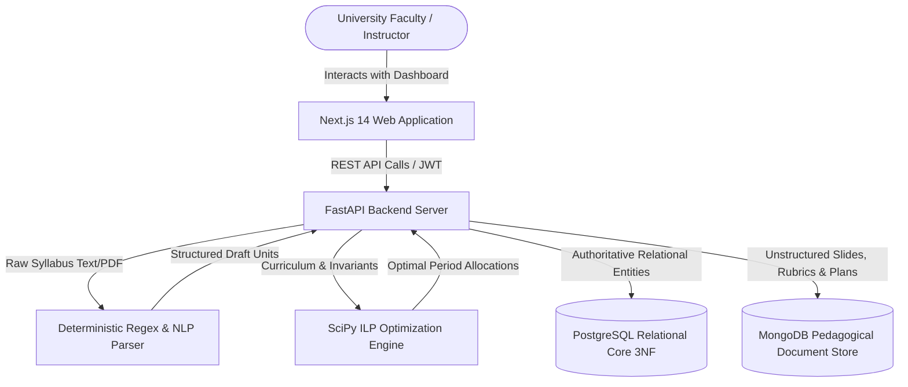
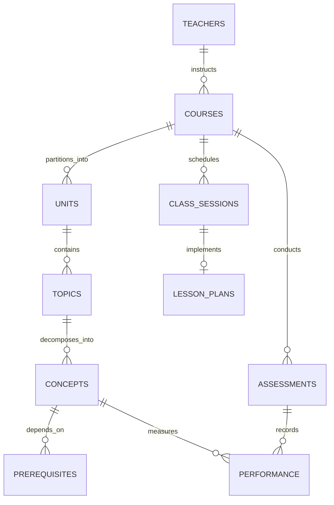

# 🏛️ OptiTeach Architecture & System Diagrams

Visual specification of OptiTeach's database-centric, polyglot architecture.

---

## 1. System Context Diagram



---

## 2. Relational Schema ERD (3NF)



---

## 3. Class Pacing & Revision Pipeline

```mermaid
sequenceDiagram
    autonumber
    actor Faculty
    participant API as FastAPI Backend
    participant Opt as Class Optimizer
    participant Rev as Revision Engine
    participant DB as Relational DB

    Faculty->>API: Request Next Class Optimization (Period N)
    API->>DB: Fetch Topic for Period N & Prerequisite Concepts
    DB-->>API: Prerequisite Concept IDs & Assessment Performances
    API->>Rev: Check Prerequisite Performance vs Threshold (60%)
    alt Prerequisite Score < 60%
        Rev-->>Opt: Inject 10-15 Min Targeted Revision Phase
    else Prerequisite Score >= 60%
        Rev-->>Opt: Standard 5-Min Warm-up Phase
    end
    Opt->>Opt: Balance Instruction (55%), Practice (30%), Exit Ticket (15%)
    Opt-->>API: 5-Phase Period Plan (Total Duration = 55 mins)
    API-->>Faculty: Render Interactive Presenter View & Lesson Plan
```
